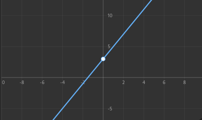
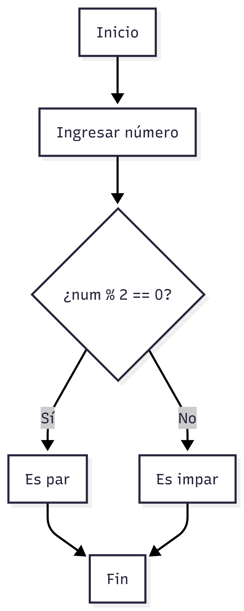
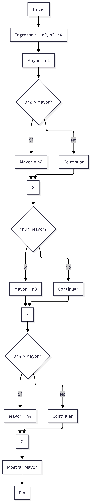
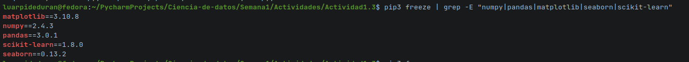

# Ciencia de datos
# Semana 1: Fundamentos de Ciencia de Datos y Big Data

---

### Guadalupe Teresa Arpide Duran / Al07148800 

---

# Actividad 1: 
## Descripción: 
 La actividad consiste en la elaboración de un reporte basado en el análisis de un caso práctico, en el cual se aplicarán los conceptos de ciencia de datos, Big Data, arquitecturas de almacenamiento de datos y bases de datos NoSQL.
## Objetivo:
Aplicar los conocimientos y habilidades adquiridas para resolver problemas reales con un enfoque práctico y eficiente.

---

## 1. Perfiles de ciencia de datos

Aplicar los conocimientos y habilidades adquiridas para resolver problemas reales con un enfoque práctico y eficiente.

Para la mejora de DeportivaMX en el manejo de sus datos, se necesita contar con un equipo:

1.- Cientifico de datos.
El analizará la información y buscará patrones o tendencia, un ejemplo de ello es que podra identificar que productos se venden más o qué prefieren los clientes. Esto ayudará a tomar mejores decisiones.

2.- Ingeniero de datos.
Será el encargadode crear y mantener la infraestructura donde se guardaran los datos, su rol será muy importante porque asegurará que la información se almacene correctamente y esté disponible cuando se necesite.

3.- Analista de datos.
Se enfocará en interpretar la información y presentarla de forma clara, en gráficas o incluso reportes, así facilitará que la empresa entienda lo que está pasando y se pueda actuar en ese momento.

---
## 2. Las 5 V

DeportivaMX con las cinco V del Big Data:

* Volumen: La empresa genera muchos datos, como ventas, información de clientes y productos.

* Velocidad: Los datos se generan rápidamente, ya que las compras se hacen en línea en tiempo real.

* Variedad: Diferentes tipos de datos, algunos estructurados como ventas y otros no estructurados como comentarios.

* Veracidad: Los datos se deben limpiar y revisar, para que sean los correctos.

* Valor: Es importante que los datos sirvan para tomar decisiones, así serviran para mejorar ventas o conocer mejor a los clientes.

---
## 3. Arquitectura de almacenamiento

En el caso de DeportivaMX, es importante contar con una buena forma de almacenar los datos debido a su crecimiento. Se recomienda usar almacenamiento en la nube, ya que permite guardar grandes cantidades de información sin necesidad de tener equipos físicos costosos. También es recomendable usar una base de datos NoSQL como MongoDB, porque permite manejar datos no estructurados y es más flexible y esto es más de uitilidad porque se manejan varios tipos de información.

---
## 4. Diseño de colecciones en JSON

CLIENTES

```json
{
  "_id": "Al07",
  "nombre": "Guadalupe Arpide",
  "correo": "lupitaarpide@gamil.com",
  "telefono": "5635362567",
  "ciudad": "CDMX",
  "fecha_registro": "2026-03-20"
}
```
PRODUCTOS
```json
{
  "_id": "Al07",
  "nombre": "Conjunto lululemon",
  "categoria": "Ropa",
  "precio": 2500,
  "stock": 10
}
```
VENTAS
```json
{
  "_id": "Al07",
  "cliente_id": "Guadalupe Arpide",
  "fecha": "2026-03-25",
  "productos": [
    {
      "producto_id": "Al07",
      "cantidad": 2,
      "precio_unitario": 2500
    }
  ],
  "total": 5000,
  "metodo_pago": "tarjeta"
}
```
COMPORTAMIENTO_USUARIO
```json
{
  "_id": "Guadalupe Arpide",
  "cliente_id": "Al07",
  "productos_vistos": ["Al07", "Al08"],
  "tiempo_en_sitio": 30
}
```
## Conclusión 
En conclusión, el uso del Big Data y la ciencia de datos es muy importante para empresas como DeportivaMX, ya que les permite manejar grandes cantidades de información y tomar mejores decisiones.

---

# 1. Ejercicios Complementarios - Semana 1

---

### Ejercicio 1: Operaciones Algebraicas Básicas
Resolver las siguientes operaciones:

```
a) 3x + 5 = 17      → x = ?
3x = 17 - 5
3x = 12
x = 4

b) 2y - 8 = 22      → y = ?
2y = 22 + 8
2y = 30
y = 15

c) 4z + 3 = 3z + 10 → z = ?
4z - 3z = 10 - 3
z = 7

d) 5(x + 2) = 35    → x = ?
x + 2 = 7
x = 5

```

**Solución:**
- a) x = 4
- b) y = 15
- c) z = 7
- d) x = 5

### Ejercicio 2: Funciones Lineales
Dada la función f(x) = 2x + 3:

- Calcular f(0), f(1), f(5), f(10)
- f(0)= 3
- f(1)= 5
- f(5)= 13
- f(10)= 23
- 
- Graficar la función e identificar la pendiente y ordenada al origen


### Ejercicio 3: Escalas y Volúmenes (Big Data)
Expresar en notación científica:

| Cantidad                    | Notación Científica |
| --------------------------- | ------------------- |
| 1,000,000 bytes             | 1*10⁶               |
| 1,000,000,000 registros     | 1*10⁹               |
| 1,000,000,000,000 bytes     | 1*10¹²              |

**Referencias:**
- 10³ = 1,000 (Kilo)
- 10⁶ = 1,000,000 (Mega)
- 10⁹ = 1,000,000,000 (Giga)
- 10¹² = 1,000,000,000,000 (Tera)
- 10¹⁵ = 1,000,000,000,000,000 (Peta)
- 10¹⁸ = 1,000,000,000,000,000,000 (Exa)

---

### Ejercicio 4: Diagramas de Flujo
Diseñar un algoritmo simple para:
1. Determinar si un número es par o impar

   
3. Calcular el promedio de 3 números
 

5. Encontrar el mayor de 4 números


### Ejercicio 5: Pseudocódigo
Escribir pseudocódigo para:
1. Calcular el factorial de un número
```
Leer n
factorial = 1
Para i desde 1 hasta n:
    factorial = factorial * i
Mostrar factorial
```
2. Buscar un elemento en una lista
```
Leer lista
Leer elemento
Para cada valor en lista:
    Si valor == elemento:
        Mostrar "Encontrado"
        Terminar
Mostrar "No encontrado"
```
3. Ordenar una lista de números
```
Leer lista
Para i desde 0 hasta longitud:
    Para j desde 0 hasta longitud-1:
        Si lista[j] > lista[j+1]:
            Intercambiar
Mostrar lista ordenada
```


### Ejercicio 6: Operaciones Booleanas
Evaluar las siguientes expresiones:

```python
a = True
b = False
c = True

# Evaluar:
print(a and b)      # False
print(a or b)      # True
print(not b)       # True
print(a and c)     # True
print((a or b) and c)  # True
```

---

### Ejercicio 7: Historia de la Ciencia de Datos
Investigar y responder:
1. ¿Quién es considerada la primera científica de datos?

La primera científica de datos es considerada Ada Lovelace, ya que fue la primera en escribir un algoritmo.

2. ¿Qué es el "Data Science Venn Diagram" de Drew Conway?

Muestra que la ciencia de datos se compone de:

* Programación (hacking skills)

* Matemáticas y estadística

* Conocimiento del dominio
  
3. Menciona 3 herramientas modernas de Big Data

* Hadoop

* Spark

* Google BigQuery

### Ejercicio 8: Aplicaciones de Big Data
Investigar un caso de uso real de Big Data en:
- Salud
  Se usa para analizar enfermedades y mejorar diagnósticos.
- Finanzas
  Detección de fraudes en transacciones bancarias.
- Redes sociales
  Recomendación de contenido.
- Deportes
  Análisis de rendimiento de jugadores y estrategias de juego.
  
---

# 2. Actividades Prácticas - Semana 1

---
## Actividad 1.1: Investigación de Conceptos Fundamentales

**Descripción:** Investiga y resume los conceptos básicos de la ciencia de datos.

**Instrucciones:**
1. Define qué es la ciencia de datos y menciona sus componentes principales
2. Explica la diferencia entre datos estructurados y no estructurados
3. Investiga qué son las 5 V del Big Data y da un ejemplo de cada una
4. Crea un mapa conceptual con los diferentes perfiles profesionales en ciencia de datos

---
## Respuestas: Actividad 1.1

### 1) Que es la ciencia de datos y componentes principales
La ciencia de datos es la disciplina que extrae conocimiento y valor a partir de datos mediante metodos estadisticos, programacion y comprension del negocio.
Componentes principales: datos, estadistica, programacion, conocimiento del dominio, visualizacion y comunicacion de resultados.

### 2) Diferencia entre datos estructurados y no estructurados
* Estructurados: tienen un formato fijo y organizado (tablas con filas/columnas), por ejemplo registros de ventas.
* No estructurados: no siguen un formato rigido (texto libre, imagenes, audio), por ejemplo comentarios de clientes o fotos.

### 3) Las 5 V del Big Data con ejemplo
* Volumen: grandes cantidades de datos, ej. millones de transacciones de una tienda.
* Velocidad: datos que llegan en tiempo real, ej. compras en linea cada segundo.
* Variedad: diferentes formatos, ej. ventas + reseñas + imagenes de productos.
* Veracidad: calidad y confiabilidad, ej. eliminar duplicados o datos incompletos.
* Valor: utilidad para el negocio, ej. aumentar ventas con recomendaciones personalizadas.

### 4) Mapa conceptual de perfiles en ciencia de datos
```
                    CIENCIA DE DATOS
                           |
    -------------------------------------------------------
    |            |              |            |            |
Cientifico   Ingeniero      Analista     Ingeniero   Arquitecto
de datos     de datos        de datos     ML          de datos
    |            |              |            |            |
Modelos      Pipelines      Reportes     Despliegue   Diseno y
Prediccion   Almacenamiento Visualizacion Monitoreo   gobernanza
Analisis     Calidad        Insights     Modelos      de datos
```

---
## Actividad 1.2: Análisis de Casos de Uso

**Descripción:** Analiza casos reales de aplicación de ciencia de datos.

**Instrucciones:**
1. Investiga 3 empresas que utilizan ciencia de datos (ej: Netflix, Amazon, Spotify)
2. Para cada empresa, identifica:
   - Qué tipo de datos recopilan
   - Qué técnicas de análisis utilizan
   - Qué problemas resuelven con los datos
3. Crea una presentación breve resumiendo tus hallazgos

---
## Respuestas: Actividad 1.2

### Empresa 1: Netflix

### Datos que recopilan:

* Historial de visualización
* Tiempo que ves cada contenido
* Búsquedas realizadas
* Calificaciones (likes/dislikes)
* Dispositivo y horario de uso ([LinkedIn][1])

### Técnicas de análisis:

* Machine Learning
* Filtrado colaborativo
* Análisis de comportamiento
* Deep Learning ([GeeksforGeeks][2])

### Problemas que resuelven:

* Recomendar contenido personalizado
* Reducir cancelaciones de usuarios
* Decidir qué series o películas producir
* Mejorar la experiencia del usuario ([GeeksforGeeks][2])

----

### Empresa 2: Amazon

### Datos que recopilan:

* Historial de compras
* Productos vistos
* Carrito y lista de deseos
* Reseñas y calificaciones
* Ubicación y preferencias de entrega ([LinkedIn][1])

### Técnicas de análisis:

* Sistemas de recomendación
* Análisis predictivo
* Big Data
* Segmentación de clientes

### Problemas que resuelven:

* Recomendar productos relevantes
* Aumentar ventas
* Optimizar logística y entregas
* Personalizar la experiencia de compra ([LinkedIn][1])

---

### Empresa 3: Spotify

### Datos que recopilan:

* Canciones escuchadas
* Listas de reproducción
* Tiempo de escucha
* Géneros musicales
* Interacciones del usuario

### Técnicas de análisis:

* Inteligencia artificial (IA)
* Procesamiento de lenguaje natural
* Sistemas de recomendación
* Análisis semántico ([Smith Hanley Associates][3])

### Problemas que resuelven:

* Crear playlists personalizadas (ej. Discover Weekly)
* Recomendar música nueva
* Mejorar la retención de usuarios
* Entender tendencias musicales ([EPAM Startups & SMBs][4])

---

## Conclusión

La ciencia de datos permite a las empresas:

* Entender mejor a sus usuarios
* Personalizar servicios
* Tomar decisiones estratégicas
* Incrementar ingresos

[1]: https://www.linkedin.com/pulse/how-netflix-amazon-use-data-science-predict-what-lthrc?utm_source=chatgpt.com "How Netflix and Amazon Use Data Science to Predict What You Like"
[2]: https://www.geeksforgeeks.org/how-netflix-uses-data-science/?utm_source=chatgpt.com "How Netflix Uses Data Science? - GeeksforGeeks"
[3]: https://www.smithhanley.com/2024/04/04/entertainment-industry-data-science/?utm_source=chatgpt.com "Entertainment Industry Data Science | Smith Hanley Associates"
[4]: https://startups.epam.com/blog/data-science-in-the-retail-industry?utm_source=chatgpt.com "Data Science in Retail Industry | EPAM Startups & SMBs"

---

## Actividad 1.3: Instalacion de librerias

### Instalacion de librerias con pip

Comando:
```bash
pip install numpy pandas matplotlib seaborn scikit-learn
```

### Creacion de archivo Jupyter
Comandos:
```bash
mkdir Actividad 1.3
touch act.ipynb
```

### Comprobar instalacion de librerias:
```bash
pip3 freeze | grep -E "numpy|pandas|matplotlib|seaborn|scikit-learn"
```



### Importacion de librerias dentro del archivo:
```python
import numpy
import pandas
import matplotlib.pyplot as plt
import seaborn
import sklearn
```

---

## Actividad 1.4: Exploración de Fuentes de Datos

**Descripción:** Explora diferentes fuentes de datos disponibles.

**Instrucciones:**
1. Investiga qué es Kaggle y cómo puedes usarlo
2. Explora al menos 3 datasets públicos en Kaggle
3. Identifica qué tipo de datos contiene cada uno
4. Elige un dataset que te interese y describe:
   - Qué información contiene
   - Qué preguntas podrías responder con esos datos

---

## Respuestas Actividad 1.4

### 1) Que es Kaggle y como usarlo
Kaggle es una plataforma en linea para ciencia de datos donde se pueden encontrar datasets publicos, kernels (notebooks), competencias y comunidad. Se puede usar creando una cuenta, buscando datasets por tema, descargandolos o analizandolos directamente en notebooks dentro de la plataforma.

### 2) Tres datasets publicos en Kaggle
1. Titanic - Machine Learning from Disaster
2. Netflix Movies and TV Shows
3. FIFA 21 Players

### 3) Tipo de datos de cada dataset
* Titanic: datos tabulares con informacion de pasajeros (edad, sexo, clase, tarifa, supervivencia).
* Netflix Movies and TV Shows: datos tabulares con informacion de catalogo (titulo, tipo, genero, pais, fecha de agregado, clasificacion).
* FIFA 21 Players: datos tabulares con estadisticas de jugadores (edad, club, posiciones, habilidades, valor).

### 4) Dataset elegido: Titanic
**Que informacion contiene:**
Incluye variables como nombre, edad, sexo, clase de boleto, tarifa, cabina, embarque y la etiqueta de supervivencia.

**Preguntas que podria responder:**
* Que factores influyeron mas en la supervivencia?
* Hubo diferencias de supervivencia por clase o genero?
* La edad afecto la probabilidad de sobrevivir?

---
### 3. Resumen de Aprendizaje

Esta semana aprendi los conceptos basicos de ciencia de datos y Big Data: perfiles profesionales, las 5 V y la diferencia entre datos estructurados y no estructurados. Tambien entendi la importancia de una buena arquitectura de almacenamiento y el uso de bases NoSQL cuando hay datos variados. En las actividades practicas resolvi ejercicios de algebra y funciones, notacion cientifica, diagramas de flujo, pseudocodigo y operaciones booleanas. Ademas investigue historia y herramientas de Big Data, analice casos de uso de Netflix, Amazon y Spotify, y explore datasets publicos en Kaggle. Con todo esto quede con una idea mas clara de como la ciencia de datos usa estadistica, programacion y negocio para tomar mejores decisiones.

---

### 4. Dudas o Preguntas

- Que criterios debo usar para elegir entre una base de datos relacional y una NoSQL en un proyecto real?

