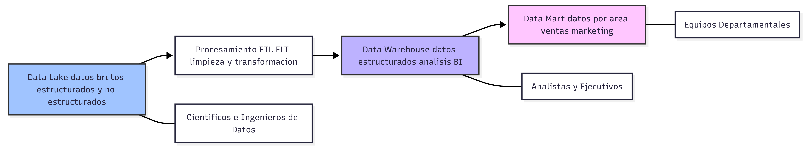

# Semana2

---
## 1. Ejercicios complementarios: Bases de Datos SQL
### Ejercicio 1: Consultas Básicas
Dada la siguiente tabla `empleados`:

| id | nombre     | departamento | salario |
| -- | ---------- | ------------ | ------- |
| 1  | Juan       | IT           | 50000   |
| 2  | María      | HR           | 45000   |
| 3  | Carlos     | IT           | 55000   |
| 4  | Ana        | Finanzas     | 48000   |
| 5  | Pedro      | Marketing    | 42000   |

Escribir consultas SQL para:
1. Seleccionar todos los empleados
2. Seleccionar nombres y salarios de empleados de IT
3. Encontrar el empleado con mayor salario
4. Contar empleados por departamento
5. Actualizar el salario de María a 50000

#### Solución
Comandos utilizados para realizar esta actividad:
```sql
-- 1. Seleccionar todos los empleados
SELECT * FROM empleados;

-- 2. Seleccionar nombres y salarios de IT
SELECT nombre, salario FROM empleados WHERE departamento = 'IT';

-- 3. Empleado con mayor salario
SELECT * FROM empleados ORDER BY salario DESC LIMIT 1;

-- 4. Contar empleados por departamento
SELECT departamento, COUNT(*) as total FROM empleados GROUP BY departamento;

-- 5. Actualizar salario de María
UPDATE empleados SET salario = 50000 WHERE nombre = 'María';
```
---
### Ejercicio 2: Joins
Dadas las tablas:

**empleados**
| id | nombre   | id_departamento |
| -- | -------- | ---------------- |
| 1  | Juan     | 1                |
| 2  | María    | 2                |
| 3  | Carlos   | 1                |

**departamentos**
| id | nombre      |
| -- | ----------- |
| 1  | IT          |
| 2  | HR          |
| 3  | Finanzas    |

Escribir consultas para:
1. INNER JOIN entre empleados y departamentos
2. LEFT JOIN mostrando todos los empleados
3. Contar empleados por departamento

#### Solución
Comandos utilizados para realizar este erjercicio:
```sql
-- 1. INNER JOIN (Solo empleados con departamento asignado)
SELECT e.nombre, d.nombre AS departamento 
FROM empleados e 
INNER JOIN departamentos d ON e.id_departamento = d.id;

-- 2. LEFT JOIN (Todos los empleados, aunque su depto no exista en la otra tabla)
SELECT e.nombre, d.nombre AS departamento 
FROM empleados e 
LEFT JOIN departamentos d ON e.id_departamento = d.id;

-- 3. Contar empleados por departamento usando JOIN
SELECT d.nombre, COUNT(e.id) 
FROM departamentos d 
LEFT JOIN empleados e ON d.id = e.id_departamento 
GROUP BY d.nombre;
```
---

### Ejercicio 3: Manipulación de JSON
Dado el siguiente JSON:

```json
{
  "empleados": [
    {"id": 1, "nombre": "Juan", "habilidades": ["Python", "SQL"]},
    {"id": 2, "nombre": "María", "habilidades": ["Java", "MongoDB"]},
    {"id": 3, "nombre": "Carlos", "habilidades": ["Python", "R"]}
  ]
}
```

1. Extraer los nombres de todos los empleados
2. Agregar una nueva habilidad a Juan
3. Crear un nuevo empleado con id: 4
4. Eliminar las habilidades de María

#### Solución
Para este ejercicio, utilice este script de Python:
```python
empleados = [
    {"id": 1, "nombre": "Juan", "salario": 50000},
    {"id": 2, "nombre": "María", "salario": 45000},
    {"id": 3, "nombre": "Carlos", "salario": 55000}
]

# 1. Agregar nuevo
empleados.append({"id": 4, "nombre": "Luis", "salario": 48000})

# 2. Buscar por id
empleado_buscado = next((e for e in empleados if e["id"] == 1), None)

# 3. Promedio
promedio = sum(e["salario"] for e in empleados) / len(empleados)

# 4. Filtrar > 50000
altos_salarios = [e for e in empleados if e["salario"] > 50000]

# 5. Actualizar nombre de id=2
for e in empleados:
    if e["id"] == 2: e["nombre"] = "María José"
```
---

### Ejercicio 4: Estructura de Datos en Python
Implementar las siguientes estructuras:

```python
# Lista de diccionarios (simulando una tabla)
empleados = [
    {"id": 1, "nombre": "Juan", "salario": 50000},
    {"id": 2, "nombre": "María", "salario": 45000},
    {"id": 3, "nombre": "Carlos", "salario": 55000}
]

# Ejercicios:
# 1. Agregar un nuevo empleado
# 2. Buscar empleado por id
# 3. Calcular promedio de salarios
# 4. Filtrar empleados con salario > 50000
# 5. Actualizar el nombre del empleado con id=2
```
#### Solución
Realice las siguientes operaciones en Python para este ejercicio:
```python
empleados = [
    {"id": 1, "nombre": "Juan", "salario": 50000},
    {"id": 2, "nombre": "María", "salario": 45000},
    {"id": 3, "nombre": "Carlos", "salario": 55000}
]

# 1. Agregar nuevo
empleados.append({"id": 4, "nombre": "Luis", "salario": 48000})

# 2. Buscar por id
empleado_buscado = next((e for e in empleados if e["id"] == 1), None)

# 3. Promedio
promedio = sum(e["salario"] for e in empleados) / len(empleados)

# 4. Filtrar > 50000
altos_salarios = [e for e in empleados if e["salario"] > 50000]

# 5. Actualizar nombre de id=2
for e in empleados:
    if e["id"] == 2: e["nombre"] = "María José"
```
---

### Ejercicio 5: Operaciones CRUD
Utilizando la colección `productos`:
```javascript
// Insertar documentos
db.productos.insertMany([
    {"nombre": "Laptop", "precio": 999, "categoria": "Electrónica"},
    {"nombre": "Mouse", "precio": 29, "categoria": "Electrónica"},
    {"nombre": "Escritorio", "precio": 299, "categoria": "Muebles"}
])

// Realizar las siguientes operaciones:
# 1. Read: Encontrar todos los productos de Electrónica
# 2. Read: Encontrar productos con precio < 100
# 3. Update: Aumentar precio de Laptop en 10%
# 4. Delete: Eliminar productos con precio < 50
# 5. Create: Agregar un nuevo producto
```
#### Solución

De esta manera realicé este ejercicio:
```javascript
// 1. Read Electrónica
db.productos.find({"categoria": "Electrónica"});

// 2. Precio < 100
db.productos.find({"precio": { $lt: 100 }});

// 3. Update Laptop +10% (de 999 a 1098.9)
db.productos.updateOne({"nombre": "Laptop"}, { $set: {"precio": 1098.9} });

// 4. Delete < 50
db.productos.deleteMany({"precio": { $lt: 50 }});

// 5. Create
db.productos.insertOne({"nombre": "Teclado Mechanical", "precio": 89, "categoria": "Electrónica"});
```
---

### Ejercicio 6: Consultas Avanzadas en MongoDB
```javascript
// Colección: estudiantes
{"nombre": "Ana", "materias": ["Math", "Physics"], "edad": 20}
{"nombre": "Luis", "materias": ["Math", "Chemistry"], "edad": 22}
{"nombre": "Sofia", "materias": ["Biology"], "edad": 19}

# Consultas:
# 1. Encontrar estudiantes que cursan Math
# 2. Encontrar estudiantes mayores de 20
# 3. Contar estudiantes por edad
# 4. Proyectar solo nombres
```

#### Solución
De esta forma hice las consultas requeridas:
```javascript
// 1. Estudiantes en Math
db.estudiantes.find({"materias": "Math"});

// 2. Mayores de 20
db.estudiantes.find({"edad": { $gt: 20 }});

// 3. Contar por edad
db.estudiantes.aggregate([{ $group: { _id: "$edad", total: { $sum: 1 } } }]);

// 4. Proyectar solo nombres
db.estudiantes.find({}, {"nombre": 1, "_id": 0});
```
---

### Ejercicio 7: Tipos de Bases de Datos NoSQL
Investigar y explicar:
1. **Documentales**: MongoDB, CouchDB
2. **Key-Value**: Redis, DynamoDB
3. **Columnar**: Cassandra, HBase
4. **Graph**: Neo4j

**Investigar:**
- ¿Cuándo usar cada tipo?
- ¿Cuáles son sus ventajas y desventajas?

#### 1. Bases de Datos Documentales
__Ejemplos: MongoDB, CouchDB.__
Guardan la información en documentos (usualmente JSON o BSON). Cada documento puede tener una estructura distinta, lo que las hace muy flexibles.

- __¿Cuándo usarlo?__: Catálogos de productos, perfiles de usuario, sistemas de gestión de contenido (CMS) o aplicaciones web que cambian rápido.

- __Ventajas__: Muy fáciles de escalar, flexibles (no necesitas definir todo al principio) y naturales para programadores (se parecen a los objetos de Python/JS).

- __Desventajas__: No son tan buenas para relaciones extremadamente complejas (muchos "joins") y pueden consumir más memoria por repetir nombres de campos en cada documento.

#### 2. Bases de Datos Clave-Valor (Key-Value)

__Ejemplos: Redis, DynamoDB.__
Es el modelo más simple: una "llave" única (como un ID) vinculada a un "valor" (que puede ser cualquier cosa). Funcionan como un diccionario gigante de Python.

- __¿Cuándo usarlo?__: Carritos de compras temporales, sesiones de usuario, caché de aplicaciones o marcadores de videojuegos en tiempo real.

- __Ventajas__: Velocidad extrema (casi instantáneas) y simplicidad total.

- __Desventajas__: No puedes hacer consultas complejas (no puedes decir "busca todos los usuarios que vivan en Querétaro" fácilmente si la ciudad no es parte de la llave).

#### 3. Bases de Datos Columnares (Wide-Column)

__Ejemplos: Cassandra, HBase.__
En lugar de guardar filas (registro por registro), guardan los datos en columnas. Esto permite leer billones de registros de una sola columna muy rápido.

- __¿Cuándo usarlo?__: Big Data, registros de logs (historial de eventos), análisis de datos masivos o telemetría de sensores IoT.

- __Ventajas__: Manejan volúmenes de datos masivos (Petabytes) y las consultas analíticas son rapidísimas.

- __Desventajas__: Muy complejas de configurar y mantener; no son aptas para aplicaciones pequeñas o transacciones simples.

#### 4. Bases de Datos de Grafos (Graph)

__Ejemplos: Neo4j, Amazon Neptune.__
Aquí lo más importante no es el dato en sí, sino la relación entre ellos. Se basan en "Nodos" (objetos) y "Aristas" (conexiones).

- __¿Cuándo usarlo?__: Redes sociales (quién es amigo de quién), motores de recomendación (Amazon/Netflix), detección de fraude bancario o logística de rutas.

- __Ventajas__: Encuentran patrones y conexiones ocultas en segundos que a una base de datos normal le tomaría horas.

- __Desventajas__: Tienen un lenguaje de consulta propio (como Cypher) que hay que aprender y no son eficientes para guardar datos simples de contabilidad.

#### Ventajas y desventajas
| Tipo        | Mayor Ventaja                          | Mayor Desventaja                  |
|------------|----------------------------------------|----------------------------------|
| Documental | Flexibilidad total de datos            | Consumo de almacenamiento        |
| Key-Value  | Velocidad de lectura/escritura         | Consultas muy limitadas          |
| Columnar   | Escritura masiva y Big Data            | Curva de aprendizaje alta        |
| Grafos     | Manejo de relaciones complejas         | No apta para datos planos        |
---

### Ejercicio 8: Arquitecturas de Almacenamiento
Investigar:
1. ¿Qué es Data Lake?
2. ¿Qué es Data Warehouse?
3. Diferencias entre OLAP y OLTP
4. ¿Qué es ETL?

#### 1. ¿Qué es un Data Lake?
Un Data Lake es un repositorio que almacena datos en su formato bruto (raw).

- __Contenido__: Guarda de todo: archivos JSON, imágenes, videos, logs de servidores, PDFs y tablas sin ninguna estructura definida.

- __Uso__: Lo usan principalmente científicos de datos para hacer experimentos o entrenar Inteligencias Artificiales, porque los datos no han sido filtrados ni modificados.

#### 2. ¿Qué es un Data Warehouse?
El Data Warehouse es como un almacén súper ordenado con estantes etiquetados. Aquí los datos ya están limpios, estructurados y listos para ser analizados.

- __Contenido__: Solo datos estructurados (tablas) que ya pasaron por un proceso de limpieza y organización.
[Semana2_Consolidado.md](Semana2_Consolidado.md)
- __Uso__: Lo usan los gerentes y analistas de negocios para crear reportes (ej. "¿Cuántos V-Bucks se vendieron en México el último mes?").

#### 3. Diferencias entre OLTP y OLAP

| Característica | OLTP (Online Transaction Processing)              | OLAP (Online Analytical Processing)         |
|---------------|--------------------------------------------------|---------------------------------------------|
| Propósito     | Operaciones del día a día (tiempo real)           | Análisis y toma de decisiones               |
| Ejemplo       | Comprar una skin en la tienda de Fortnite         | Saber qué skin fue la más vendida del año   |
| Velocidad     | Milisegundos (muy rápida)                         | Segundos o minutos (consultas pesadas)      |
| Diseño        | Optimizado para escritura constante               | Optimizado para lectura masiva              |

#### 4.¿Qué es ETL?
ETL (Extract, Transform, Load) es el proceso que mueve los datos desde donde se crean hasta donde se analizan (el Data Warehouse).

- __Extract__: Sacas los datos de diferentes fuentes (MongoDB, SQL, archivos de texto).

- __Transform__: Aquí ocurre la magia. Limpias los datos, quitas errores, conviertes monedas y les das un formato uniforme para que todos se entiendan.

- __Load__: Guardas los datos ya limpios en el destino final (Data Warehouse).

---
---
## 2. Actividades Prácticas
### Actividad 2.1:

#### 1. ¿Qué son los Data Warehouses y Data Lakes?

- __Data Warehouse__: Es un sistema que agrega datos de diversas fuentes (como bases de datos operativas o sistemas transaccionales) en un único repositorio central y coherente.
- __Data Lake__: Es un repositorio diseñado para almacenar grandes volúmenes de datos sin procesar (en bruto), generalmente utilizando almacenamiento de objetos en la nube de bajo costo.

#### 2. Características de cada uno

##### - Data Warehouse
- __Datos estructurados__: Está optimizado principalmente para datos que tienen un formato definido.
- __Proceso ETL__: Tradicionalmente, los datos se limpian, organizan y transforman antes de ser cargados en el almacén (esquema en escritura).
- __Uso empresarial__: Se utiliza para iniciativas de business intelligence (BI), informes, paneles y análisis de datos históricos por parte de usuarios comerciales.
- __Costo y rendimiento__: Ofrecen un rendimiento sólido para consultas complejas, pero tienen costos más altos y menos flexibilidad para manejar datos masivos sin procesar.

##### - Data Lake
- __Diversidad de formatos__: Permite la ingesta de datos estructurados, semiestructurados y no estructurados (como texto libre, imágenes, videos y registros de IoT).
- __Esquema en lectura__: Los datos se ingieren en su estado original y no se transforman hasta que se necesitan para un análisis específico.
- __Ciencia de datos e IA__: Son ideales para el machine learning, la ciencia de datos y la analítica de big data, ya que estas tareas requieren acceso a grandes conjuntos de datos diversos y detallados.
- __Escalabilidad__: Son altamente escalables y más rentables que los almacenes tradicionales para el almacenamiento multipropósito a gran escala.

#### 3. ¿Qué es un Data Mart?

Un Data Mart es un subconjunto de un almacén de datos (data warehouse) que se centra específicamente en una línea de negocio, un departamento o un área temática en particular.
Lo que hace es facilitarle a los trabajadores de ciertas áreas de negocio el acceso a los datos necesarios para realizar sus tareas.

#### 4. Diagrama sobre las diferencias entre ellos.


---

### Actividad 2.2:

#### Crear base de datos de prueba.
Como MongoDB Compass no funcionaba, hice todo en terminal.

Primero ejecuté el siguiente comando para abrir la terminal de mongo:

```bash
mongosh
```

Una vez dentro de mongo, ingrese el siguiente comando:
```bash
use actividad2
```

#### Crear una coleccion y agregar 5 documentos de ejemplo.
```bash
db.createCollection("estudiantes")
```

```bash
db.estudiantes.insertMany([
|   { "nombre": "Emiliano", "carrera": "Software Engineering", "semestre": 3, "intereses": ["Arch Linux", "Python"] },
|   { "nombre": "Carlos", "carrera": "Software Engineering", "semestre": 2, "intereses": ["Web Design", "React"] },
|   { "nombre": "Ximena", "carrera": "Data Science", "semestre": 4, "intereses": ["Machine Learning", "R"] },
|   { "nombre": "Mateo", "carrera": "Cybersecurity", "semestre": 5, "intereses": ["Networking", "C++"] },
|   { "nombre": "Lucía", "carrera": "Software Engineering", "semestre": 1, "intereses": ["Logic", "Java"] }
| ])
```
---

### Actividad 2.3:
Para realizar las operaciones CRUD solcitadas en esta actividad, realice el siguiente scrpit en Python:
```python
from pymongo import MongoClient #Se importa la funcion MongoClient de la libreria pymongo

def operaciones_crud():
    client = MongoClient('mongodb://localhost:27017/')
    db = client['empresa_db']
    coleccion = db['empleados']

    coleccion.drop() # Se utiliza para limpiar la base de datos.

    print("--- Empezando... ---")

    # CREATE
    empleados_datos = [
            {"nombre": "Emiliano", "departamento": "Sistemas", "salario": 35000},
            {"nombre": "Ana", "departamento": "Sistemas", "salario": 32000},
            {"nombre": "Luis", "departamento": "Recursos Humanos", "salario": 25000},
            {"nombre": "Sofia", "departamento": "Ventas", "salario": 28000},
            {"nombre": "Carlos", "departamento": "Sistemas", "salario": 31000},
            {"nombre": "Maria", "departamento": "Ventas", "salario": 29000},
            {"nombre": "Jorge", "departamento": "Marketing", "salario": 27000},
            {"nombre": "Lucia", "departamento": "Recursos Humanos", "salario": 26000},
            {"nombre": "Miguel", "departamento": "Marketing", "salario": 27500},
            {"nombre": "Elena", "departamento": "Ventas", "salario": 28500}
        ]

    coleccion.insert_many(empleados_datos)
    print("Listo, datos insertados")

    # READ
    print("\n--- Empleados de Sistemas ---")
    dep_sistemas = {"departamento": "Sistemas"}
    for emp in coleccion.find(dep_sistemas):
            print(f"Empleado: {emp['nombre']} | Salario: ${emp['salario']}")

    # UPDATE
    print("\n--- Aumentando salario a Emiliano ---")
    filtro_usuario = {"nombre": "Emiliano"}
    nuevo_salario = {"$set": {"salario": 40000}}
    coleccion.update_one(filtro_usuario, nuevo_salario)

    # Verificar actualización
    empleado_actualizado = coleccion.find_one({"nombre": "Emiliano"})
    print(f"Cambio confirmado: {empleado_actualizado['nombre']} ahora gana ${empleado_actualizado['salario']}")


    # DELETE
    print("\n--- Eliminando a Luis (RRHH) ---")
    coleccion.delete_one({"nombre": "Luis"})

    # Verificar eliminación
    total = coleccion.count_documents({})
    print(f"Operación finalizada. Empleados restantes en DB: {total}")

if __name__ == "__main__":
    operaciones_crud()


```
---

### Actividad 2.4:
Descripción: Diseña un modelo de datos para un caso específico.

#### Instrucciones:

- Elige un caso: "Sistema de biblioteca digital"
- Diseña la estructura de documentos necesaria
- Crea al menos 5 colecciones con relaciones
- Define los campos y tipos de datos
- Justifica tu diseño
- Carpeta de entrega: Semana2/Actividades/Actividad2.4/
--- 

#### Sistema de gestion de una frutería

##### Creacion de colecciones

###### 1- Productos
```json
{
  "_id": ObjectId("..."),
  "nombre": "Manzana",
  "categoria": "Frutas",
  "precio_por_unidad": 15.00,
  "unidad_medida": "kg",
  "stock_actual": 45.5,
  "detalles": {
    "origen": "Chihuahua",
    "temporada": "Otoño-Invierno",
    "organico": true
  }
}
```

###### 2- Inventario
```json
{
  "_id": ObjectId("..."),
  "id_producto": ObjectId("..."),
  "fecha_ingreso": ISODate("2026-04-01T08:00:00Z"),
  "fecha_caducidad_estimada": ISODate("2026-04-10T00:00:00Z"),
  "proveedor": "Vendedor de frutas",
  "estado": "maduro"
}
```

###### 3- Clientes
```json
{
  "_id": ObjectId("..."),
  "nombre": "Ximena",
  "telefono": "4421234567",
  "direccion_entrega": "Colonia Centro, Querétaro",
  "puntos_lealtad": 120,
  "preferencias": ["Frutos rojos", "Cítricos"]
}
```

###### 4- Ventas
```json
{
  "_id": ObjectId("..."),
  "id_cliente": ObjectId("..."),
  "fecha_venta": ISODate("2026-04-03T14:30:00Z"),
  "articulos": [
    { "nombre": "Plátano", "cantidad": 1.5, "subtotal": 30.00 },
    { "nombre": "Aguacate", "cantidad": 0.8, "subtotal": 65.00 }
  ],
  "total": 95.00,
  "metodo_pago": "Efectivo"
}
```

###### 5- Ofertas
```json
{
  "_id": ObjectId("..."),
  "titulo": "Martes de Cítricos",
  "descuento_porcentaje": 15,
  "productos_aplicables": [ObjectId("..."), ObjectId("...")],
  "activo": true
}
```

##### Justificación
Decidí usar MongoDB (NoSQL) para este ejemplo porque me di cuenta de que una frutería no es tan "rígida" como una tabla de Excel. Estas fueron mis razones:

- __1. Flexibilidad de Productos__: A diferencia de una tabla rígida, aquí puedo registrar productos por kilo (manzanas), por pieza (piñas) o por manojo (cilantro) en una misma 
colección sin complicaciones.

- __2. Rapidez en Ventas__: Al guardar la lista de productos comprados directamente dentro del ticket de venta (documento embebido), el sistema no tiene que buscar en varias tablas. 
Esto hace que cobrar sea mucho más rápido.

- __3. Control de Frescura__: Creé una colección de lotes para saber qué fruta llegó primero. Así el sistema me ayuda a vender lo más antiguo antes de que se eche a perder, 
reduciendo el desperdicio.

- __4. Enfoque en el Cliente__: Puedo guardar los gustos de mis clientes frecuentes en su perfil de forma sencilla. Si llega su fruta favorita, el sistema me permite identificarlos 
rápido para darles un mejor servicio.

<br>

Para mí es un modelo simple y flexible, totalmente funcional para una frutería, ya que se adapta a los cambios de inventario que estas tienen al día a día

---

## 3. Resumen de Aprendizaje


---

## 4. Dudas o Preguntas

Aún tengo dudas sobre la estructura que debemos seguir en nuestro repositorio.
He leído todos los documentos que nos proporcionó; sin embargo, encuentro inconsistencias entre las estructuras planteadas, las cuales son las siguientes:

### Estructura de GitHub
```
Semana2/
├── Consolidado/
│   └── Semana2_Consolidado.md    # Documento consolidado semanal
├── Actividad2/
│   ├── Analisis.py                # Código Python del análisis
│   ├── datos_ventas.csv          # Dataset generado
│   └── Visualizaciones/           # Gráficas generadas
└── commits documentados
```

### Estructura de entrega
```
Semana2/
├── Actividad2.md                    # Actividad evaluable (NO entregable, es guía)
├── Consolidado/                     # CREA ESTA CARPETA
│   └── Semana2_Consolidado.md      # ESTE ES TU ENTREGABLE
└── [tus archivos: código, datos, etc.]
```

Considero que ya me queda clara la estructura del Consolidado; sin embargo, mi duda se centra en la carpeta Actividad2 o Actividades.

En primer lugar, no tengo claro cómo debe nombrarse, ya que en otro documento se indica que las actividades deben ubicarse en la ruta ./Actividades/Actividad2.1, mientras que en la 
estructura anterior se menciona que la carpeta debe llamarse Actividad2. Esto me genera confusión sobre cuál es la nomenclatura correcta, por lo mientras opte por crear otra carpeta que
se llame Actividad2 y tenga el contenido de la actividad principal.

Finalmente, quisiera confirmar si el archivo del consolidado debe contener únicamente el archivo .md con la explicación de lo realizado en cada ejercicio y en las actividades 
complementarias.

Gracias.


## 5. Referencias
- Amazon Web Services. (s. f.). *¿Qué es el procesamiento analítico en línea (OLAP)?*  
  https://aws.amazon.com/es/what-is/olap/

- Content Studio. (2025, 26 noviembre). *¿Qué es una base de datos columnar?* Everpure (antes Pure Storage).  
  https://www.purestorage.com/es/knowledge/what-is-a-columnar-database.html

- MongoDB. (s. f.). *Document Database - NoSQL*.  
  https://www.mongodb.com/resources/basics/databases/document-databases

- IBM. (2025, noviembre 27). *ETL*.  
  https://www.ibm.com/mx-es/think/topics/etl

- IBM. (2025, noviembre 27). *Mercado de datos (Data Mart)*.  
  https://www.ibm.com/mx-es/think/topics/data-mart

- IBM. (2025, noviembre 27). *OLTP*.  
  https://www.ibm.com/mx-es/think/topics/oltp

- Jonker, A., Holdsworth, J., & Kosinski, M. (2025, noviembre 27). *Data warehouse*. IBM.  
  https://www.ibm.com/mx-es/think/topics/data-warehouse

- Jonker, A., & Kosinski, M. (2026, marzo 20). *Data lake*. IBM.  
  https://www.ibm.com/mx-es/think/topics/data-lake

- Google Cloud. (s. f.). *¿Qué es una base de datos de grafos?*  
  https://cloud.google.com/discover/what-is-a-graph-database?hl=es

- Amazon Web Services. (s. f.). *What is a document database?*  
  https://aws.amazon.com/nosql/document/

- Amazon Web Services. (s. f.). *What is a graph database?*  
  https://aws.amazon.com/nosql/graph/

- MongoDB. (s. f.). *What is a key-value database?*  
  https://www.mongodb.com/resources/basics/databases/key-value-database

- Amazon Web Services. (s. f.). *What is a key-value database?*  
  https://aws.amazon.com/nosql/key-value/