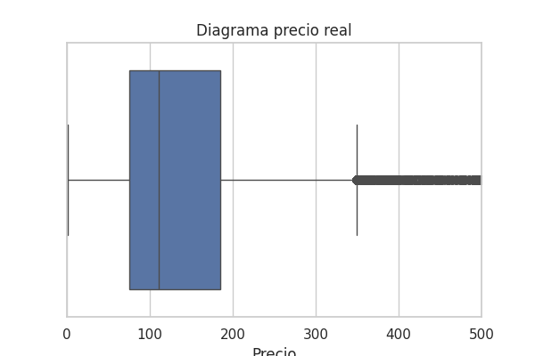
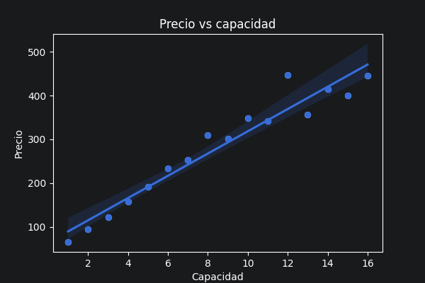
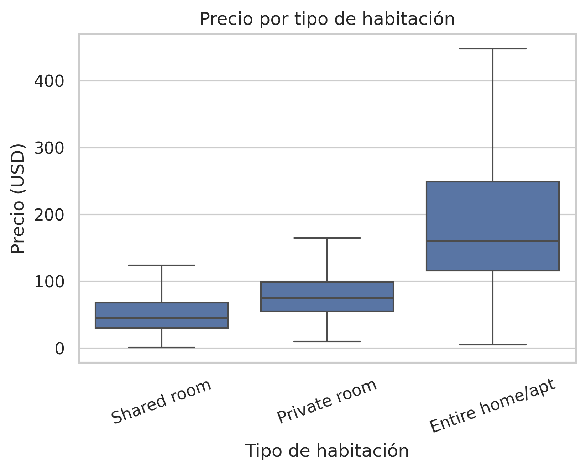
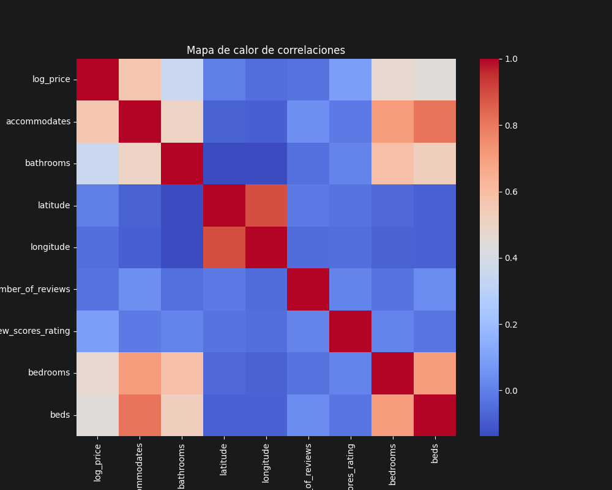

# Semana2

---
## 1. Avance del proyecto

### Introducción
En esta fase inicial, comenzarás tu inmersión en el análisis predictivo del mercado inmobiliario. Se te proporcionará una base de datos, que contiende datos cruciales sobre el mercado inmobiliario, que incluye, pero no se limita a precios, ubicaciones y características físicas de las propiedades. Llevarás a cabo un análisis exploratorio de datos (EDA) profundo para familiarizarte con estos, prepararlos para el análisis y descubrir patrones iniciales, tendencias y posibles anomalías. Este paso es esencial para cualquier proyecto de ciencia de datos, ya que establece una base sólida para el modelado predictivo posterior.

---

### __Parte 1__: Base de datos
1. Carga la base de datos a Python e importa las librerías que utilizarás a lo largo de todo el análisis.
```python
import pandas as pd
import numpy as np
import matplotlib.pyplot as plt
import seaborn as sns

# Cargar base de datos
df = pd.read_csv('Datos/Base_de_datos_Proyecto.csv', sep=",", header=0, index_col=0, encoding="utf-8", engine="python")

# Ver primeras filas
print(df.head())

# Información general
print(df.info())
```
--- 
### __Parte 2: Análisis Exploratorio de Datos (EDA)__
1. Análisis descriptivo: calcula estadísticas para cada variable (media, mediana, desviación estándar, etc.). Identifica las variables que podrían influir más en el precio de una vivienda.
```python
# Estadísticas básicas
print("========== ESTADÍSTICAS BÁSICAS ==========\n")
print(df.describe())

# Estadísticas incluyendo variables categóricas
print("\n========== ESTADÍSTICAS CON VARIABLES ==========\n")
print(df.describe(include='all'))
```

2. Visualización de datos: Genera visualizaciones que ayuden a entender la distribución de las variables más importantes, la relación entre el precio de la vivienda y otras variables para identificar patrones o tendencias. Utiliza Matplotlib, Seaborn o cualquier otra biblioteca de visualización en Python. Ejemplos de gráficos a considerar incluyen histogramas, box plots, scatter plots y mapas de calor para correlaciones.
```python 
plt.figure(figsize=(6,4))
sns.boxplot(x=df["log_price"])

plt.title("Diagrama Precio log")
plt.xlabel("Precio")
plt.savefig("./Visualizaciones/Diagrama_precio_log.png")
plt.show()

precio_real = np.exp(df["log_price"])

plt.figure(figsize=(6,4))
sns.boxplot(x=precio_real)

plt.title("Diagrama precio real")
plt.xlabel("Precio")

plt.xlim(0, 500)

plt.savefig("./Visualizaciones/Diagrama_precio_real.png")
plt.show()
```


## Diagrama de cajas (precio)

Se utilizó un gráfico de cajas (boxplot) para analizar la distribución de los precios de los alojamientos tipo Airbnb en Estados Unidos, sin considerar variables adicionales como amenidades, tipo de cama o número de habitaciones.
Al inicio se utilizó la variable __"log_price"__, la cual representa el logaritmo del precio, pero ya que esta variable no representa directamente a un costo, se realizó una conversión  para obtener el precio real y facilitar su interpretación.

#### Interpretación:
Como podemos observar en las gráficas, los precios de los airbnb sin contemplar cantidad de amenidades, cuartos, tipos de cama ni temporada son de $75.00 - $180.00 USD.

```python
promedio = df.groupby("accommodates")["log_price"].mean()
costo_promedio = np.exp(promedio.values)
figure(figsize=(6,4))
sns.scatterplot(x=promedio.index, y=costo_promedio)
sns.regplot(x=promedio.index, y=costo_promedio)
plt.title("Precio vs capacidad")

plt.xlabel("Capacidad")
plt.ylabel("Precio")

plt.savefig("./Visualizaciones/PrecioCapacidad.png")
plt.show() 
```

## Precio vs Capacidad
Anteriormente, se pudo observar por que precios rondan los Airbnb en Estados Unidos, en esta gráfica se profundiza en los factores que influyen en dichos precios, específicamente la relación entre la capacidad del alojamiento y su costo.

PPara este análisis, se agruparon los datos por la variable __"accommodates"__ y se calculó el promedio de __"log_price"__ para cada grupo, una vez agrupados a los valores promedio de "log_price" se hizo la conversión a un precio real.

#### __Interpretación:__
A partir de la gráfica, se observa una tendencia positiva clara: a medida que aumenta la capacidad del alojamiento, también incrementa el precio promedio. Esto indica que la capacidad es un factor importante en la determinación del precio.

```python
plt.figure(figsize=(6,4))

sns.boxplot(x=df["room_type"], y=precio_real, order=["Shared room", "Private room", "Entire home/apt"], showfliers=False)

plt.title("Precio por tipo de habitación")
plt.xlabel("Tipo de habitación")
plt.ylabel("Precio (USD)")

plt.xticks(rotation=20)

plt.savefig("./Visualizaciones/PrecioTipoHabitacion.png", dpi=300, bbox_inches="tight")
plt.show()
```

## Precio por tipo de  habitación
Al analizar el dataset, se identifican tres tipos principales de alojamientos en Airbnb: Shared room, Private room y Entire home/apt. Con el fin de profundizar en el análisis, se evaluó cómo varían los precios entre estos tipos de habitación utilizando un diagrama de cajas.

#### __Interpretación:__
- Shared room: Se puede observar que el precio ronda desde el dólar hasta los 120.00 USD, pero la mayoría se centra de los 20.00 USD a los 70.00 USD.
- Private room: Se puede observa que el precio ronda desde los 10.00 USD hasta los 170.00 USD, pero la mayoría se centra de los 50.00 USD a los 100.00 USD
- Entire home/apt: Por último el tipo de habitación que es más caro ronda desde los 5.00 USD a los 470.00 USD y la mayoría se centra en el rango de los 120.00 USD a los 250.00 USD

```python
corr = df.select_dtypes(include="number").corr()

plt.figure(figsize=(10,8))
sns.heatmap(corr, cmap="coolwarm", annot=False)
plt.title("Mapa de calor de correlaciones")
plt.savefig("./Visualizaciones/MapaCorrelaciones.png")
plt.show()
```


## Mapa de calor de Correlaciónes
Con el objetivo de identificar qué variables influyen en el precio de los Airbnb, se utilizó un mapa de calor de correlaciones. Este mapa permite visualizar la relación entre las distintas variables del dataset, facilitando la identificación de aquellas que tienen mayor impacto en el precio.

#### __Interpretación:__
En primer lugar, se descarta la diagonal principal del mapa de calor, ya que representa la correlación de cada variable consigo misma, la cual siempre es igual a 1 y no aporta información relevante para el análisis.

Al analizar la variable log_price, se observa que las variables que muestran mayor correlación positiva son aquellas relacionadas con el tamaño y la capacidad del Airbnb, como accommodates, bedrooms, beds y bathrooms. Esto indica que, a mayor capacidad o tamaño del inmueble, el precio es mayor.

Y variables como latitude y longitude, que representan la ubicación, muestran una correlación cercana a cero con el precio, lo que sugiere que en este dataset su influencia es limitada. Al igual que variables como el número de reseñas y las calificaciones también presentan una relación débil .

---

## 2. Ejercicios Complementarios
### Ejercicio 1: Variables y Tipos de Datos  

```python
# 1. Variables
entero = 10
flotante = 3.14
cadena = "Python"
booleano = True
lista = [1, 2, 3]
diccionario = {"nombre": "Ana", "edad": 20}

print(type(entero), type(flotante), type(cadena), type(booleano))

# 2. Conversión de tipos
num_str = "25"
num_int = int(num_str)

num_float = 5.8
num_int2 = int(num_float)

num_entero = 7
num_float2 = float(num_entero)

print(num_int, num_int2, num_float2)

# 3. f-strings
edad = 21
print(f"El usuario tiene {edad} años")
```

### Ejercicio 2: Control de Flujo
```python
# 1. Número positivo, negativo o cero
numero = int(input("Ingresa un número: "))

if numero > 0:
    print("Positivo")
elif numero < 0:
    print("Negativo")
else:
    print("Cero")

# 2. Menú
opcion = int(input("1. Saludar\n2. Despedirse\nElige opción: "))

if opcion == 1:
    print("Hola")
elif opcion == 2:
    print("Adiós")
else:
    print("Opción inválida")

# 3. Loop for
lista = [10, 20, 30]
for elemento in lista:
    print(elemento)

# 4. While factorial
n = 5
factorial = 1
i = 1

while i <= n:
    factorial *= i
    i += 1

print("Factorial:", factorial)
```
### Ejercicio 3: Funciones
```python
import math

# 1. Área de círculo
def area_circulo(radio):
    return math.pi * radio**2

# 2. Celsius a Fahrenheit
def celsius_a_fahrenheit(c):
    return (c * 9/5) + 32

# 3. Promedio
def promedio(lista):
    return sum(lista) / len(lista)

# 4. Máximo y mínimo
def max_min(lista):
    return max(lista), min(lista)

print(area_circulo(5))
print(celsius_a_fahrenheit(25))
print(promedio([1, 2, 3, 4]))
print(max_min([10, 5, 8]))
```
### Ejercicio 4: Operaciones con NumPy
```python
import numpy as np

arr1 = np.array([1, 2, 3, 4, 5])
arr2 = np.array([5, 4, 3, 2, 1])

# 1. Suma
suma = arr1 + arr2

# 2. Multiplicar por escalar
mult = arr1 * 3

# 3. Estadísticas
media = np.mean(arr1)
mediana = np.median(arr1)
desv = np.std(arr1)

# 4. Valores únicos
unicos = np.unique([1, 2, 2, 3, 4, 4])

# 5. Reshape
arr_2d = arr1.reshape(5, 1)

print(suma, mult, media, mediana, desv, unicos, arr_2d)
```

### Ejercicio 5: Aljebra con NumPy
```python
v1 = np.array([1, 2, 3])
v2 = np.array([4, 5, 6])

# 1. Producto punto
punto = np.dot(v1, v2)

# 2. Producto cruz
cruz = np.cross(v1, v2)

# 3. Magnitud
mag1 = np.linalg.norm(v1)
mag2 = np.linalg.norm(v2)

# 4. Normalización
norm1 = v1 / mag1
norm2 = v2 / mag2

print(punto, cruz, mag1, mag2, norm1, norm2)

```

### Ejercicio 6: DataFrames Básico
```python
import pandas as pd

data = {
    'nombre': ['Ana', 'Luis', 'María', 'Carlos', 'Sofia'],
    'edad': [20, 22, 19, 21, 23],
    'carrera': ['Ing', 'Ing', 'Lic', 'Ing', 'Lic'],
    'promedio': [8.5, 9.0, 7.8, 8.2, 9.5]
}

df = pd.DataFrame(data)

# 1. Seleccionar columna
print(df['nombre'])

# 2. Filtrar
print(df[df['promedio'] > 8.5])

# 3. Ordenar
print(df.sort_values('edad'))

# 4. Nueva columna
df['aprobado'] = df['promedio'] >= 7

# 5. Group by
print(df.groupby('carrera')['promedio'].mean())
```
### Ejercicio 7: Manipulación de Datos
```python
# 1. Valores faltantes
df.loc[0, 'promedio'] = None
df['promedio'] = df['promedio'].fillna(df['promedio'].mean())

# 2. Duplicados
df = df.drop_duplicates()

# 3. apply()
df['doble_edad'] = df['edad'].apply(lambda x: x * 2)

# 4. loc e iloc
print(df.loc[0])
print(df.iloc[0:2])

# 5. Concatenar
df2 = df.copy()
df_concat = pd.concat([df, df2])
```

### Ejercicio 8: Matplotlib
```python
import matplotlib.pyplot as plt
import numpy as np

x = np.linspace(0, 10, 100)
y = np.sin(x)

# Línea
plt.plot(x, y)
plt.title("Gráfico de línea")
plt.show()

# Dispersión
plt.scatter(x, y)
plt.title("Scatter")
plt.show()

# Histograma
plt.hist(y, bins=20)
plt.title("Histograma")
plt.show()

# Barras
plt.bar([1,2,3], [3,5,7])
plt.title("Barras")
plt.show()
```

### Ejercicio 9:
```python
import pandas as pd
import seaborn as sns

df = sns.load_dataset("iris")

# Info
print(df.info())

# Estadísticas
print(df.describe())

# Histogramas
df.hist(figsize=(8,6))

# Correlación
sns.heatmap(df.corr(), annot=True)

# Boxplot
sns.boxplot(x="species", y="sepal_length", data=df)
```

## Actividades Complementarias:

### Actividad 3.1:
```python

# 1. LISTAS

# Lista de números
numeros = [1, 2, 3, 4, 5, 6, 7, 8, 9, 10]

print("Lista original:", numeros)

# 2. DICCIONARIOS

# Diccionario con información de estudiantes
estudiantes = {
    "Emi": {"edad": 20, "promedio": 8.7},
    "Pato": {"edad": 50, "promedio": 9.1},
    "Furia": {"edad": 19, "promedio": 7.8}
}

print("\nDiccionario de estudiantes:")
for nombre, datos in estudiantes.items():
    print(f"{nombre} -> Edad: {datos['edad']}, Promedio: {datos['promedio']}")

# 3. DATAFRAMES

# Importamos pandas para trabajar con DataFrames
import pandas as pd

# Convertimos el diccionario en una tabla
df_estudiantes = pd.DataFrame([
    {"Nombre": nombre, "Edad": datos["edad"], "Promedio": datos["promedio"]}
    for nombre, datos in estudiantes.items()
])

print("\nDataFrame de estudiantes:")
print(df_estudiantes)

# Agregamos una columna nueva usando una condición
df_estudiantes["Aprobado"] = df_estudiantes["Promedio"] >= 7.0

print("\nDataFrame con columna 'Aprobado':")
print(df_estudiantes)

# 4. FUNCIONES LAMBDA

# Función lambda para duplicar un número
duplicar = lambda x: x * 2

# Aplicamos lambda a la lista de números
duplicados = list(map(duplicar, numeros))

print("\nNúmeros duplicados con lambda:")
print(duplicados)

# Otra lambda: verificar si un número es mayor que 5
mayor_que_5 = lambda x: x > 5
print("\n¿7 es mayor que 5?:", mayor_que_5(7))

# 5. MANEJO DE ERRORES

# Intentamos realizar una división controlando posibles errores
try:
    numero1 = int(input("\nIngresa un número entero: "))
    numero2 = int(input("Ingresa otro número entero: "))
    division = numero1 / numero2
    print(f"Resultado de la división: {division}")

except ValueError:
    print("Error: Bro, debes ingresar números enteros válidos.")

except ZeroDivisionError:
    print("Error: no se puede dividir entre cero, pasaste el kinder?.")

# 6. CINCO EJERCICIOS BÁSICOS

# Ejercicio 1: Verificar si un número es positivo, negativo o cero
def clasificar_numero(n):
    if n > 0:
        return "positivo"
    elif n < 0:
        return "negativo"
    else:
        return "cero"

print("\nEjercicio 1:")
print("El número -3 es", clasificar_numero(-3))
print("El número 0 es", clasificar_numero(0))
print("El número 8 es", clasificar_numero(8))

# Ejercicio 2: Calcular el factorial de un número con while
def factorial(n):
    resultado = 1
    contador = 1
    while contador <= n:
        resultado *= contador
        contador += 1
    return resultado

print("\nEjercicio 2:")
print("Factorial de 5:", factorial(5))

# Ejercicio 3: Calcular el promedio de una lista
def calcular_promedio(lista):
    if len(lista) == 0:
        return 0
    return sum(lista) / len(lista)

notas = [8, 9, 7, 10, 6]
print("\nEjercicio 3:")
print("Notas:", notas)
print("Promedio:", calcular_promedio(notas))

# Ejercicio 4: Encontrar el valor máximo y mínimo
def maximo_y_minimo(lista):
    if len(lista) == 0:
        return None, None
    return max(lista), min(lista)

mayor, menor = maximo_y_minimo(numeros)
print("\nEjercicio 4:")
print("Lista:", numeros)
print("Máximo:", mayor)
print("Mínimo:", menor)

# Ejercicio 5: Contar cuántas vocales tiene una palabra
def contar_vocales(palabra):
    vocales = "aeiouAEIOU"
    contador = 0
    for letra in palabra:
        if letra in vocales:
            contador += 1
    return contador

palabra = "programacion"
print("\nEjercicio 5:")
print(f"La palabra '{palabra}' tiene {contar_vocales(palabra)} vocales")


```

---
### Actividad 3.2:

#### Información del dataset
```python
df.info()
```

### Tipos de datos
```python
print(df.dtypes)
```
### Valores nulos
```python
print(df.isnull().sum())
```

### Estadísticas básicas
```python
df.describe()
```

---

### Actividad 3.3: Limpieza de Datos
#### Dataset: precios históricos del oro

#### Cargar el dataset
```python
import pandas as pd

df = pd.read_csv("../Actividad3.2/finalgolddata.csv")
df.head()
```

#### Renombrar columnas a minúsculas
```python
df.columns = df.columns.str.lower()
print(df.columns.tolist())
```

#### Convertir la columna Date a tipo fecha
```python
df["date"] = pd.to_datetime(df["date"], format="%d-%m-%y")
print(df["date"].dtype)
df["date"].head(3)
```

#### Revisar y manejar valores nulos
```python
print("Nulos antes:")
print(df.isnull().sum())

# Si hay nulos los rellenamos con el valor de antes para no perder datos
df["open"] = df["open"].ffill()
df["high"] = df["high"].ffill()
df["low"] = df["low"].ffill()
df["close"] = df["close"].ffill()
df["volume"] = df["volume"].fillna(0)

print("\nNulos después:")
print(df.isnull().sum())
```

#### Eliminar duplicados
```python
print("Duplicados:", df.duplicated().sum())
df = df.drop_duplicates()
print("Duplicados después:", df.duplicated().sum())
```

#### Crear nuevas columnas
```python
# Sacar el año y el mes de la fecha
df["year"] = df["date"].dt.year
df["month"] = df["date"].dt.month

# Cuánto varió el precio en el día (entre el más alto y el más bajo)
df["rango_diario"] = df["high"] - df["low"]

# Si el precio subió o bajó comparando apertura y cierre
df["cambio"] = df["close"] - df["open"]

df.head()
```

#### Estado final del dataset
```python
print(df.shape)
print(df.dtypes)
df.head()
```

#### Conclusiones

- Le cambié los nombres a las columnas para que fueran en minúsculas y así no tener que estar poniendo mayúsculas cada vez.
- La columna de fecha estaba guardada como texto y la convertí a formato fecha.
- No había datos nulos ni repetidos en este dataset.
- Agregué columnas nuevas: el año, el mes, cuánto varió el precio en el día y si subió o bajó entre apertura y cierre.

---

### Actividad 3.4 - Visualización Exploratoria
#### Dataset: precios históricos del oro (ya limpiado)
#### 1. Histograma del precio de cierre
```python
import matplotlib.pyplot as plt
import seaborn as sns

plt.figure(figsize=(8, 4))
plt.hist(df["close"], bins=40)
plt.title("Distribución del precio de cierre del oro")
plt.xlabel("Precio de cierre (USD)")
plt.ylabel("Frecuencia")
plt.savefig("HistogramaPrecio.png")
plt.show()
```


__Interpretación:__ La mayoría de los precios están entre 200 y 2000 dólares más o menos. Se ve que hay muchos más días con precios bajos que con precios muy altos. Y es porque el oro era más barato antes y con el tiempo fue subiendo.

#### 2. Gráfico de barras: precio promedio por año
```python
promedio_año = df.groupby("year")["close"].mean()

plt.figure(figsize=(12, 4))
plt.bar(promedio_año.index, promedio_año.values)
plt.title("Precio promedio de cierre por año")
plt.xlabel("Año")
plt.ylabel("Precio promedio (USD)")
plt.xticks(rotation=45)
plt.tight_layout()
plt.savefig("PrecioPromDeCiere.png")
plt.show()
```

__Interpretación:__ Se ve bien claro que el precio fue subiendo cada año. En el año 2000 era muy barato y en los más recientes está muy caro.

#### 3. Diagrama de dispersión: precio de apertura vs precio de cierre
```python
plt.figure(figsize=(6, 5))
plt.scatter(df["open"], df["close"], alpha=0.3, s=5)
plt.title("Precio de apertura vs precio de cierre")
plt.xlabel("Precio de apertura (USD)")
plt.ylabel("Precio de cierre (USD)")
plt.tight_layout()
plt.savefig("PrecioDeApertura_VS_PrecioDeCierre.png")
plt.show()
```


__Interpretación:__ Los puntos forman casi una línea diagonal, eso significa que el precio de apertura y el de cierre son casi iguales cada día. Tiene sentido porque en un solo día el precio no va a cambiar muchísimo.

#### 4. Mapa de calor de correlaciones
```python
columnas = ["open", "high", "low", "close", "volume", "rango_diario", "cambio"]
correlaciones = df[columnas].corr()

plt.figure(figsize=(7, 5))
sns.heatmap(correlaciones, annot=True, fmt=".2f", cmap="coolwarm")
plt.title("Mapa de calor de correlaciones")
plt.tight_layout()
plt.savefig("heatmap_correlaciones.png")
plt.show()
```

__Interpretación:__ Los precios open, high, low y close tienen números muy cercanos a 1, lo que quiere decir que están muy relacionados entre sí. El volumen tiene números más chicos, eso significa que no tiene mucha relación con el precio.


---

## 3. Resumen de Aprendizaje

* Refuerzo de fundamentos de Python: variables, tipos de datos, condicionales, ciclos y funciones. 
* Uso de NumPy para operaciones matemáticas y manipulación de arreglos. 
* Manejo de Pandas: creación, filtrado, ordenamiento y agrupación de DataFrames. 
* Limpieza de datos: tratamiento de valores nulos, eliminación de duplicados y conversión de tipos. 
* Creación de nuevas variables para enriquecer el análisis. 
* Visualización de datos con Matplotlib y Seaborn (histogramas, boxplots, scatter y heatmaps). 
* Interpretación de distribuciones, tendencias y relaciones entre variables. 
* Aplicación del análisis exploratorio de datos (EDA) para entender datasets. 
* Identificación de variables relevantes mediante correlaciones. 
* Integración de todo el flujo: carga, limpieza, análisis y visualización de datos.

---

## 4. Dudas o Preguntas
Ninguna.
