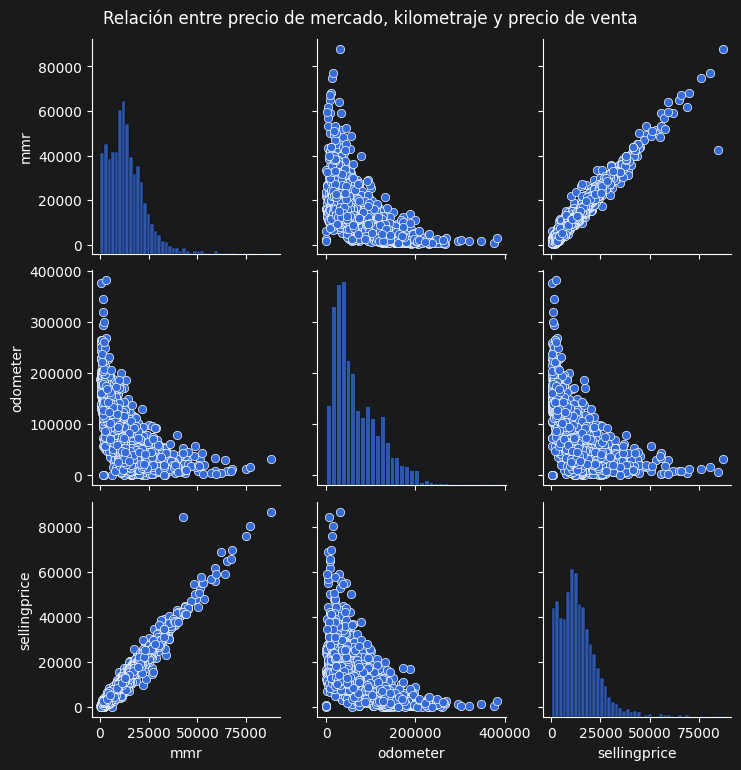
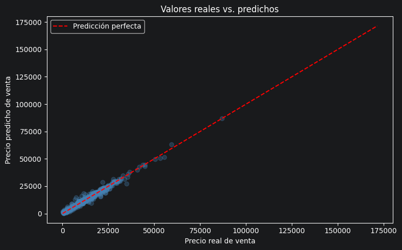
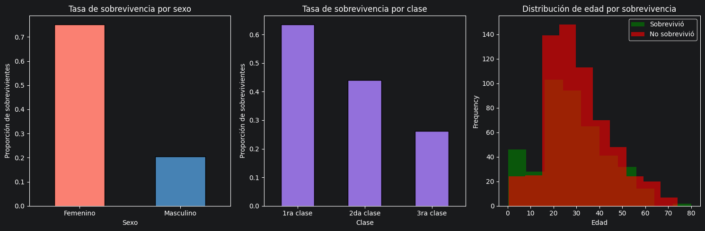
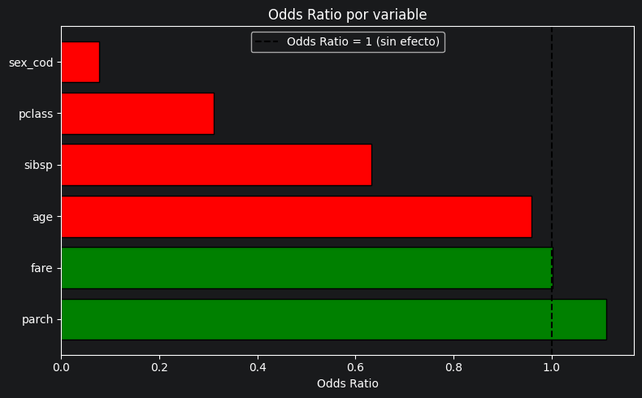

# Semana 4: Consolidado

## 1. Actividad 4
__Parte1__: 

### Actividad 4 - Parte 1: Predicción de ventas usando regresión lineal múltiple

En esta sección de la actividad, crearás y evaluarás un modelo de regresión lineal múltiple para predecir las ventas de los vehículos de acuerdo con el precio de venta establecido y el kilometraje de los mismos.

#### 1. Preparación de los datos

Primero importamos las bibliotecas que vamos a necesitar y cargamos la base de datos en una variable.

```python
import pandas as pd
import numpy as np
import matplotlib.pyplot as plt
import seaborn as sns
from sklearn.linear_model import LinearRegression
from sklearn.model_selection import train_test_split
from sklearn.metrics import r2_score, mean_squared_error

df = pd.read_csv
```

```python
# Vemos el tamanio del dataset y las columnas
print("Forma del dataset:", df.shape)
print()
print(df.dtypes)
```

```terminaloutput
Forma del dataset: (558837, 16)

year              int64
make                str
model               str
trim                str
body                str
transmission        str
vin                 str
state               str
condition       float64
odometer        float64
color               str
interior            str
seller              str
mmr             float64
sellingprice    float64
saledate            str
dtype: object
```

```python
# Seleccionamos solo las columnas que usaremos y eliminamos los valores nulos
df_modelo = df[["mmr", "odometer", "sellingprice"]].dropna()

df_modelo.describe()

```

#### 2. Análisis exploratorio

 Realiza una gráfica de dispersión para verificar la relación que existe entre el precio, el kilometraje y las ventas. Para esto, utiliza pairplot de la biblioteca Seaborn, la cual te permitirá visualizar las relaciones entre estas variables.


```python
muestra = df_modelo.sample(n=2000, random_state=42)

sns.pairplot(muestra)
plt.suptitle("Relación entre precio de mercado, kilometraje y precio de venta", y=1.02)
plt.show()
```



__Interpretación:__ En el pairplot podemos observar:
- Existe una relación lineal positiva fuerte entre mmr (precio de mercado) y sellingprice (precio de venta): a mayor precio de mercado, mayor precio de venta.
- La relación entre odometer (kilometraje) y sellingprice es negativa: a mayor kilometraje, menor precio de venta.
- Esto nos indica que ambas variables son buenos candidatos para predecir el precio de venta.


#### 3. Identificación de variables

 Determina cuáles son las variables independientes y cuál es la dependiente.

```python
# Variables independientes
X = df_modelo[["mmr", "odometer"]]

# Variable dependiente
y = df_modelo["sellingprice"]

print("Variables independientes (X):")
print(X.head())
print()
print("Variable dependiente (y):")
print(y.head())
```

```terminaloutput
Variables independientes (X):
       mmr  odometer
0  20500.0   16639.0
1  20800.0    9393.0
2  31900.0    1331.0
3  27500.0   14282.0
4  66000.0    2641.0

Variable dependiente (y):
0    21500.0
1    21500.0
2    30000.0
3    27750.0
4    67000.0
Name: sellingprice, dtype: float64
```

#### 4. División de datos

Crea los grupos de entrenamiento y de prueba para tus variables. Esta división es esencial para entrenar tu modelo con un conjunto de datos y evaluar su rendimiento con otro, asegurando así que el modelo sea capaz de generalizar a nuevos datos.

Dividimos los datos en dos grupos:
- __Entrenamiento (80%):__ Se usa para que el modelo aprenda.
- __Prueba (20%):__ Se usa para evaluar qué tan bien aprendió el modelo con datos que nunca ha visto.

```python

X_train, X_test, y_train, y_test = train_test_split(X, y, test_size=0.2, random_state=42)

```

#### 5. Modelado

Aplica el modelo de regresión lineal múltiple.

```python
modelo = LinearRegression()

modelo.fit(X_train, y_train)

print("Coeficientes:")
for nombre, coef in zip(["mmr", "odometer"], modelo.coef_):
    print(f"  {nombre}: {coef:.4f}")
```

```terminaloutput
Coeficientes:
  mmr: 0.9869
  odometer: -0.0011
```

__Interpretación de los coeficientes:__
- El coeficiente de `mmr` indica cuánto aumenta el precio de venta por cada dólar de incremento en el precio de mercado.
- El coeficiente de `odometer` indica cuánto disminuye el precio de venta por cada kilómetro adicional recorrido.


#### 6. Evaluación del modelo

Usamos el coeficiente de determinación R² para saber qué tan bien se ajusta el modelo a los datos.

- R² = 1 significa ajuste perfecto.
- R² = 0 significa que el modelo no explica nada.
- Entre más cercano a 1, mejor.


```python
r2_train = r2_score(y_train, modelo.predict(X_train))

r2_test = r2_score(y_test, modelo.predict(X_test))

print(f"R2 entrenamiento: {r2_train:.4f}")
print(f"R2 prueba:        {r2_test:.4f}")

```

```terminaloutput
R2 entrenamiento: 0.9673
R2 prueba:        0.9686
```

## 7. Predicción

Con el modelo entrenado, realizamos predicciones con el conjunto de prueba y comparamos los valores predichos con los valores reales.

```python
# Realizamos las predicciones sobre el conjunto de prueba
y_pred = modelo.predict(X_test)

# Comparación datos reales vs predichos
comparacion = pd.DataFrame({
    "Valor real": y_test.values[:10],
    "Valor predicho": y_pred[:10].round(2)
})

print(comparacion)

# Visualización valores reales vs predichos
plt.figure(figsize=(8, 5))
plt.scatter(y_test[:500], y_pred[:500], alpha=0.3, color="steelblue")
plt.plot([y_test.min(), y_test.max()], [y_test.min(), y_test.max()], "r--", label="Predicción perfecta")
plt.xlabel("Precio real de venta")
plt.ylabel("Precio predicho de venta")
plt.title("Valores reales vs. predichos")
plt.legend()
plt.tight_layout()
plt.show()


```

```terminaloutput
   Valor real  Valor predicho
0     11200.0        12343.09
1     16900.0        18680.20
2     13600.0        12623.26
3      4800.0         5859.96
4     17400.0        17151.72
5     20000.0        18065.43
6      6800.0        12983.98
7      9000.0         8962.12
8      9700.0         9956.56
9     12750.0        13044.11
```


## 8. Error cuadrático medio

El error cuadrático medio nos dice cuánto se equivoca el modelo en promedio. Entre más pequeño, mejor. También calculamos la raíz del MSE (RMSE) para interpretarlo en las mismas unidades que el precio de venta.


```python
mse = mean_squared_error(y_test, y_pred)
rmse = np.sqrt(mse)

print(f"Error cuadrático medio (MSE): {mse:,.2f}")
print(f"Raíz del error cuadrático medio (RMSE): ${rmse:,.2f}")

```

```terminaloutput
Error cuadrático medio (MSE): 2,995,581.36
Raíz del error cuadrático medio (RMSE): $1,730.77
```

__Interpretación__

Esto significa que, en promedio, el modelo se equivoca en ±$1,730.77 al predecir el precio de venta.


#### 9. Conclusión

A partir del análisis realizado, podemos concluir lo siguiente:

- El modelo de regresión lineal múltiple logró un R² cercano a 0.96, lo que indica que el modelo explica alrededor del 96% de la variación en el precio de venta de los vehículos.
- Las variables mmr (precio de mercado) y odometer (kilometraje) tienen una relación clara con el precio de venta: el precio de mercado tiene un efecto positivo muy fuerte, mientras que el kilometraje tiene un efecto negativo moderado.
- El RMSE obtenido indica el margen de error promedio del modelo al predecir precios.

__Posibles mejoras:__
- Incluir más variables como el año del vehículo, la marca o el estado de la unidad para mejorar las predicciones.
- Eliminar valores atípicos (outliers) que puedan estar afectando el rendimiento del modelo.


---

__Parte 2__:
# Actividad 4 - Parte 2: Análisis de sobrevivencia en el Titanic

Esta sección de la actividad se enfoca en la creación y evaluación de un modelo de regresión logística binaria. El objetivo principal será determinar las variables más significativas para predecir la sobrevivencia de los pasajeros del Titanic.

#### 1. Preparación de los datos

Importamos las bibliotecas necesarias y cargamos la base de datos en una variable.

```python
import pandas as pd
import numpy as np
import matplotlib.pyplot as plt
import seaborn as sns
from scipy import stats
from sklearn.linear_model import LogisticRegression
from sklearn.model_selection import train_test_split
from sklearn.metrics import classification_report, confusion_matrix, accuracy_score
from sklearn.preprocessing import LabelEncoder

df = pd.read_csv("titanic.csv")
df.head()

```
```python
print(df.shape)
print(df.dtypes)

```

```terminaloutput
(1309, 14)
pclass       int64
survived     int64
name           str
sex            str
age            str
sibsp        int64
parch        int64
ticket         str
fare           str
cabin          str
embarked       str
boat           str
body           str
home.dest      str
dtype: object
```

#### 2. Limpieza de datos

Examina las columnas disponibles en tu conjunto de datos y decide cuáles no son necesarias para tu análisis, elimina las que no consideres necesarias.  Además, identifica los datos nulos que tengas y elimínalos.

```python
# Columnas disponibles
print("Columnas:", df.columns.tolist())

```

```terminaloutput
Columnas: ['pclass', 'survived', 'name', 'sex', 'age', 'sibsp', 'parch', 'ticket', 'fare', 'cabin', 'embarked', 'boat', 'body', 'home.dest']
```

```python
# Eliminamos columnas que no son relevantes para predecir sobrevivencia
df = df.drop(columns=["name", "ticket", "cabin", "boat", "body", "home.dest"])
print("Columnas utiles:", df.columns.tolist())

```

```terminaloutput
Columnas utiles: ['pclass', 'survived', 'sex', 'age', 'sibsp', 'parch', 'fare', 'embarked']
```

```python
# En este dataset los valores faltantes están puestos como "?"

df = df.replace("?", np.nan)

# Verificamos cuántos nulos hay por columna
print("Valores nulos por columna:")
print(df.isnull().sum())

```

```terminaloutput
Valores nulos por columna:
pclass        0
survived      0
sex           0
age         263
sibsp         0
parch         0
fare          1
embarked      2
dtype: int64
```

```python
# Eliminamos las filas con valores nulos
df = df.dropna()

```

#### 3. Conversión de variables a su formato correcto
Dependiendo de las variables en tu conjunto de datos, es posible que necesites convertir algunas de ellas a un tipo de dato más apropiado, como convertir variables categóricas a tipo 'category' o ajustar las fechas a un formato de fecha y hora.

```python
# Convertimos columnas numéricas
df["age"] = pd.to_numeric(df["age"])
df["fare"] = pd.to_numeric(df["fare"])

# Convertimos columnas categóricas
df["sex"] = df["sex"].astype("category")
df["embarked"] = df["embarked"].astype("category")

print(df.dtypes)
df.head()
```

```terminaloutput
pclass         int64
survived       int64
sex         category
age          float64
sibsp          int64
parch          int64
fare         float64
embarked    category
dtype: object

   pclass  survived     sex      age  sibsp  parch      fare embarked
0       1         1  female  29.0000      0      0  211.3375        S
1       1         1    male   0.9167      1      2  151.5500        S
2       1         0  female   2.0000      1      2  151.5500        S
3       1         0    male  30.0000      1      2  151.5500        S
4       1         0  female  25.0000      1      2  151.5500        S
```

```python
le = LabelEncoder()
df["sex_cod"] = le.fit_transform(df["sex"])
df["embarked_cod"] = le.fit_transform(df["embarked"])

print("Valor de 'sex':")
print(df[["sex", "sex_cod"]].drop_duplicates())

```

```terminaloutput
Valor de 'sex':
      sex  sex_cod
0  female        0
1    male        1
```

#### 4. Visualización de datos

Analiza los datos de forma gráfica para verificar que existe una relación entre la variable dependiente y la independiente.

```python
fig, axes = plt.subplots(1, 3, figsize=(15, 5))

# Tasa de sobrevivencia por sexo
df.groupby("sex")["survived"].mean().plot(kind="bar", ax=axes[0], color=["salmon", "steelblue"], edgecolor="black")
axes[0].set_title("Tasa de sobrevivencia por sexo")
axes[0].set_xlabel("Sexo")
axes[0].set_ylabel("Proporción de sobrevivientes")
axes[0].set_xticklabels(["Femenino", "Masculino"], rotation=0)

# Tasa de sobrevivencia por clase
df.groupby("pclass")["survived"].mean().plot(kind="bar", ax=axes[1], color="mediumpurple", edgecolor="black")
axes[1].set_title("Tasa de sobrevivencia por clase")
axes[1].set_xlabel("Clase")
axes[1].set_ylabel("Proporción de sobrevivientes")
axes[1].set_xticklabels(["1ra clase", "2da clase", "3ra clase"], rotation=0)

# Distribución de edad por sobrevivencia
df[df["survived"] == 1]["age"].plot(kind="hist", ax=axes[2], alpha=0.6, color="green", label="Sobrevivió")
df[df["survived"] == 0]["age"].plot(kind="hist", ax=axes[2], alpha=0.6, color="red", label="No sobrevivió")
axes[2].set_title("Distribución de edad por sobrevivencia")
axes[2].set_xlabel("Edad")
axes[2].legend()

plt.tight_layout()
plt.show()

```



__Interpretación:__
- Las mujeres tuvieron una tasa de sobrevivencia notablemente más alta que los hombres.
- Los pasajeros de primera clase sobrevivieron en mayor proporción que los de segunda y tercera clase.
- La distribución de edad es similar entre sobrevivientes y no sobrevivientes, aunque los niños pequeños parecen tener mayor proporción de sobrevivencia.


#### 5. Prueba t-test

Aplicamos una prueba t para verificar si existe una diferencia estadísticamente significativa en la __edad__ entre los pasajeros que sobrevivieron y los que no.

```python
# Separamos las edades por grupo
sobrevivieron = df[df["survived"] == 1]["age"]
no_sobrevivieron = df[df["survived"] == 0]["age"]

# Aplicamos la prueba t
t_stat, p_value = stats.ttest_ind(sobrevivieron, no_sobrevivieron)

print(f"Estadístico t: {t_stat:.4f}")
print(f"Valor p: {p_value:.4f}")

print(f"\nEdad promedio de sobrevivientes: {sobrevivieron.mean():.2f} años")
print(f"Edad promedio de no sobrevivientes: {no_sobrevivieron.mean():.2f} años")

```

```terminaloutput
Estadístico t: -1.8555
Valor p: 0.0638

Edad promedio de sobrevivientes: 28.82 años
Edad promedio de no sobrevivientes: 30.50 años
```

__Interpretacion:__

No hay una diferencia estadísticamente significativa en la edad entre los grupos (p >= 0.05).

#### 6. División de datos

Divide los datos en variables de prueba y de entrenamiento. Esto es crucial para entrenar el modelo y luego evaluar su capacidad para generalizar a nuevos datos

```python
# Variables independientes
X = df[["pclass", "sex_cod", "age", "sibsp", "parch", "fare"]]

# Variable dependiente
y = df["survived"]

# División en entrenamiento y prueba
X_train, X_test, y_train, y_test = train_test_split(
    X, y, test_size=0.2, random_state=42
)

```

#### 7. Creación del modelo

Creamos el modelo de regresión logística binaria y lo entrenamos con los datos de entrenamiento.

```python
modelo = LogisticRegression(max_iter=1000, random_state=42)
modelo.fit(X_train, y_train)

y_pred = modelo.predict(X_test)

```

#### 8. Estimación de los coeficientes y los odds ratio

Una vez que entrenaste el modelo, el siguiente paso es interpretar los resultados. Esto se hace mediante la estimación de los coeficientes, los cuales te indicarán la fuerza y dirección de la relación entre cada variable independiente y la variable dependiente.

```python
# Coeficientes del modelo
coeficientes = pd.DataFrame({
    "Variable": X.columns,
    "Coeficiente": modelo.coef_[0],
    "Odds Ratio": np.exp(modelo.coef_[0])
})

coeficientes = coeficientes.sort_values("Odds Ratio", ascending=False)
print(coeficientes.to_string(index=False))

```

```terminaloutput
Variable  Coeficiente  Odds Ratio
   parch     0.106183    1.112025
    fare     0.001395    1.001396
     age    -0.042647    0.958249
   sibsp    -0.458269    0.632377
  pclass    -1.169060    0.310659
 sex_cod    -2.566516    0.076803
```

```python
# Visualizamos los odds ratio
plt.figure(figsize=(8, 5))
colors = ["green" if x > 1 else "red" for x in coeficientes["Odds Ratio"]]
plt.barh(coeficientes["Variable"], coeficientes["Odds Ratio"], color=colors, edgecolor="black")
plt.axvline(x=1, color="black", linestyle="--", label="Odds Ratio = 1 (sin efecto)")
plt.title("Odds Ratio por variable")
plt.xlabel("Odds Ratio")
plt.legend()
plt.tight_layout()
plt.show()

```




__Interpretación de los odds ratio:__
- __Odds Ratio > 1 (barras verdes):__ La variable aumenta la probabilidad de sobrevivir.
- __Odds Ratio < 1 (barras rojas):__ La variable disminuye la probabilidad de sobrevivir.
- Por ejemplo, si `sex_cod` tiene odds ratio menor a 1, significa que ser hombre (codificado como 1) reduce significativamente la probabilidad de sobrevivir comparado con ser mujer.


#### 9. Conclusión

- Las variables con __mayor impacto__ en la probabilidad de sobrevivencia fueron:
  - __Sexo:__ Las mujeres tuvieron una probabilidad mucho mayor de sobrevivir (política de "mujeres y niños primero").
  - __Clase del pasajero:__ Los pasajeros de primera clase tuvieron mayor acceso a botes salvavidas, aumentando su probabilidad de sobrevivencia.
  - __Tarifa pagada (fare):__ Relacionada con la clase, también mostró efecto positivo.

__Posibles mejoras:__
- No se me ocurrieron


---

## 3. Resumen de Aprendizaje

- Interpretación de coeficientes (relaciones positivas y negativas)
- Evaluación con R² y RMSE
- Uso de regresión logística para clasificación
- Interpretación de odds ratio
- Aplicación de t-test e interpretación de p-value

---
## 4. Dudas o Preguntas
Ninguna profe.
